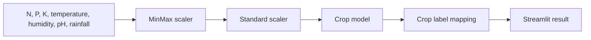

# Crop Recommendation System


This repository contains a Streamlit crop recommendation app that predicts a suitable crop from soil nutrients and weather conditions.

## Features

- Numeric input validation for soil and climate variables
- Cached loading for model and scaler artifacts
- Clear model-artifact checks
- Educational disclaimer for real-world use
- Cleaned repository structure without committed virtual-environment files

## Architecture



## Project Structure

```text
crop-recommendation-system/
|-- app.py
|-- requirements.txt
|-- README.md
|-- .gitignore
|-- model.pkl
|-- minmaxscaler.pkl
`-- standscaler.pkl
```

## Quick Start

```bash
python -m venv .venv
.venv\\Scripts\\activate
pip install -r requirements.txt
streamlit run app.py
```

On macOS/Linux:

```bash
source .venv/bin/activate
```

## Inputs

```text
Nitrogen, Phosphorus, Potassium, Temperature, Humidity, pH, Rainfall
```

## Security and Reliability Notes

- The model and scaler files are pickle artifacts. Only load pickle files from trusted sources.
- The old committed `myenv/` virtual environment has been removed from tracking and added to `.gitignore`.
- This is an educational ML demo, not an agronomic decision system.

## Development Workflow

```bash
python -m compileall app.py
streamlit run app.py
```

## Roadmap

- Add training notebook and dataset provenance
- Add model metrics and model card
- Add tests for input shape and crop label mapping
- Replace pickle artifacts with a safer reproducible training/export workflow

## Troubleshooting

| Issue | Fix |
|---|---|
| Missing artifact error | Confirm `model.pkl`, `minmaxscaler.pkl`, and `standscaler.pkl` are present. |
| Clone is slow | The tracked virtual environment was removed in the cleanup commit; pull the latest version. |
| Prediction label is unknown | Check that the label mapping matches the trained model labels. |

## License

No license file is currently included. Add a license before reusing or distributing this project.
